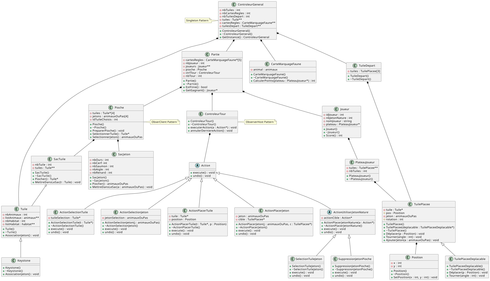

Cascadia – Implémentation C++ (console + base Qt)

Projet universitaire (UTC – LO21) : implémentation du jeu de plateau Cascadia en C++.
Le code suit les règles officielles (pose de tuiles hexagonales, placement de jetons Faune, surpopulation, jetons Nature, scoring par cartes Faune et couloirs d’habitats), avec une interface console complète et une base d’interface Qt (squelette) pour une future GUI. Référence règles : livret officiel de Cascadia.

✨ Fonctionnalités

Partie solo et multijoueurs (2–4), déroulement complet de tours.

Pioche/renouvellement de tuiles Habitat et jetons Faune, gestion de la surpopulation (3/4 identiques) et Jetons Nature.

Vérifications de règles : compatibilité des jetons avec les habitats, cases libres, ordre des actions du tour.

Scoring automatique : cartes de marquage Faune (Ours, Wapiti, Saumon, Buse, Renard) + couloirs d’habitats + majorités + jetons Nature.

Sauvegarde / reprise de partie en JSON (état du plateau, pioche, cartes, historique d’actions).

Modèle orienté objet & design patterns (Singleton pour ControleurGeneral et Partie, système d’Actions sérialisables pour exécuter/annuler).

Plateau hexagonal en coordonnées axiales (SE/SW/W/E/NW/NE) pour une gestion propre des voisins.

Une première base Qt (architecture MVC) est fournie : MainWindow, PlateauGraphique, TuileGraphique (non finalisée).

🧱 Architecture (aperçu)

Modèle : Tuile, Jeton, PlateauJoueur (liste de TuilePlacee avec position axiale, rotation, jeton optionnel).

Contrôle : ControleurGeneral (réserve globale tuiles/jetons/cartes), Partie (orchestration joueurs/tours/pioche), ControleurTour.

Actions (pattern Command) : ActionSelectionTuile, ActionPlacerTuile, ActionSelectionJeton, ActionPlacerJeton + annuler() et sérialisation JSON.

I/O : console (affichage plateau stylisé + prompts) et persistance JSON (sauvegarde/chargement).

📦 Prérequis

C++17 ou plus

CMake (recommandé) ou g++/clang++

(Optionnel) Qt 6 pour tester la base GUI

